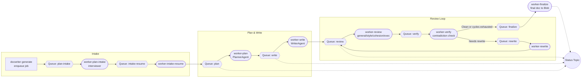

DocWriter v3 — AI Document Writer

Overview
- Generates long, consistent Markdown documents (>60 pages) with Mermaid diagrams.
- Agentic pipeline: Planner (o3), Writer (gpt-4.1), Reviewer set (o3: general + style + cohesion + executive summary).
- Queue-driven architecture on Azure Service Bus; artifacts stored in Azure Blob Storage.
- Terminal-first CLI to enqueue jobs, run stage workers, resume intake, and monitor status.
- Well-structured Python package with tests and documentation.
 - Interactive intake: collects detailed requirements before planning for higher quality.

Quick Start (Queue-only)
1) Install dependencies
   - Python 3.10+
   - Create a virtualenv, then:
     pip install -e .[dev]
   - PDF export uses WeasyPrint; install its system dependencies (Cairo, Pango). See https://weasyprint.readthedocs.io/en/stable/install/ for platform-specific guidance.
2) Configure environment variables
   - Export credentials and queue names before running workers or the API. Example:
     ```bash
     export OPENAI_API_KEY=...
     export OPENAI_BASE_URL=...
     export OPENAI_API_VERSION=...
     export SERVICE_BUS_CONNECTION_STRING=...
     export SERVICE_BUS_QUEUE_PLAN_INTAKE=docwriter-plan-intake
     export SERVICE_BUS_QUEUE_INTAKE_RESUME=docwriter-intake-resume
     export SERVICE_BUS_QUEUE_PLAN=docwriter-plan
     export SERVICE_BUS_QUEUE_WRITE=docwriter-write
     export SERVICE_BUS_QUEUE_REVIEW=docwriter-review
     export SERVICE_BUS_QUEUE_VERIFY=docwriter-verify
     export SERVICE_BUS_QUEUE_REWRITE=docwriter-rewrite
     export SERVICE_BUS_QUEUE_FINALIZE=docwriter-finalize
     export SERVICE_BUS_TOPIC_STATUS=docwriter-status
     export AZURE_STORAGE_CONNECTION_STRING=...
     export AZURE_BLOB_CONTAINER=docwriter
     ```
   - Optional overrides: `DOCWRITER_PLANNER_MODEL`, `DOCWRITER_WRITER_MODEL`, `DOCWRITER_STREAM`, etc. See `src/docwriter/config.py` for the full list.
3) Run CLI
   - Start intake workers:
     docwriter worker-plan-intake
     docwriter worker-intake-resume
   - Enqueue a job (targets >60 pages):
     docwriter generate \
       --title "Large Language Models in Production" \
       --audience "Senior engineers" \
       --out /absolute/path/document.md \
       --cycles 3
   - Start remaining workers (each in own terminal or scaled horizontally):
     docwriter worker-plan
     docwriter worker-write
     docwriter worker-review
     docwriter worker-verify
     docwriter worker-rewrite
     docwriter worker-finalize
   - Watch status events:
     docwriter monitor
   - Answer intake:
     1) Open the Blob path from status event INTAKE_READY (jobs/<job_id>/intake/questions.json)
     2) Prepare answers.json and upload via:
        docwriter resume --job-id <job_id> --answers /path/answers.json
     3) Pipeline continues automatically

Architecture (Queue-driven)
- Agents
  - Planner (o3): Produces a structured document plan, outline, glossary, constraints, and diagram specs.
  - Writer (gpt-4.1): Writes section-by-section with a shared memory (style + facts) to maintain consistency.
  - Reviewers (o3):
    - General reviewer: contradictions and quality with revised draft.
    - Style reviewer: clarity, tone, readability.
    - Cohesion reviewer: flow, transitions, cross-references.
    - Executive summary reviewer: summary quality.
  - Interviewer (o3): Conducts an intake to gather goals, audience specifics, constraints, and preferences.
- Stage workers
  - PLAN_INTAKE (questions to Blob) → INTAKE_RESUME (user answers) → PLAN → WRITE → REVIEW (incl. style/cohesion/exec) → VERIFY → REWRITE → back to REVIEW (loop by cycles) → VERIFY → FINALIZE
  - Enforces dependency-aware order and performs contradiction verification and targeted rewrites.
- Clients
  - OpenAI client abstraction supports streaming and model selection per agent.
  - Service Bus producer/worker and Status topic for horizontal scaling and monitoring.



Azure Hosting Plan (in progress)
- **Azure Functions per stage:** Each queue processor (plan-intake, intake-resume, plan, write, review, verify, rewrite, finalize) will run as an independent Python Azure Function with a Service Bus trigger, reusing the existing `process_*` handlers.
- **Container Apps deployment:** Functions and the new REST API will be packaged as container images and hosted on Azure Container Apps for horizontal scaling and simplified ops.
- **Public API:** A lightweight FastAPI service will mirror core CLI commands (enqueue job, resume intake, status polling) so future web clients can integrate without shell access. CLI remains fully supported.
- **Terraform IaC:** Infrastructure modules (`infra/terraform`) will provision Service Bus resources, Blob Storage, Container Apps, monitoring, and identity wiring. Sample Dockerfiles and deployment scripts will live in `infra/docker` and `scripts/`.
- `infra/terraform` now contains initial modules for the resource group, Service Bus namespace, storage account, monitoring, and Container Apps environment. Provide container image references via `terraform.tfvars` before running `terraform init && terraform apply`.
- `.github/workflows/docker-build.yml` builds/pushes all container images to an Azure Container Registry using OpenID Connect. Configure repository secrets `AZURE_CLIENT_ID`, `AZURE_TENANT_ID`, `AZURE_SUBSCRIPTION_ID`, `ACR_NAME`, and `ACR_LOGIN_SERVER` before enabling the workflow.
- **Shared configuration:** All runtimes (CLI, Functions, API) read configuration exclusively from environment variables.

FastAPI / REST usage (early preview)
- Start locally: `uvicorn api.main:app --reload`
- `POST /jobs` → Enqueue a document (`{"title": "...", "audience": "..."}`)
- `POST /jobs/{job_id}/resume` → Upload intake answers (`{"answers": {...}}`) and advance the pipeline
- `POST /intake/questions` → Generate a questionnaire tailored to a proposed title
- `GET /healthz` → Basic health-check
  (More endpoints and authentication will be added alongside the UI.)

_Target directory highlights_
```
src/
  docwriter/              # shared core logic (existing)
  functions_*             # Azure Function apps per stage (plan_intake, plan, write, ...)
  functions_shared/       # shared Azure Function utilities
  api/                    # REST interface built on the same orchestrators
infra/
  terraform/              # Service Bus, Storage, Container Apps, monitoring
  docker/                 # container definitions for functions/API
config/
  functions.settings.json # local Functions config example
```
Documentation and deployment scripts will be updated as those components land.

Mermaid Diagrams
- The writer embeds diagrams using fenced code blocks:
  ```
  ```mermaid
  graph TD
  A[User] --> B[CLI]
  B --> C[Planner]
  C --> D[Writer]
  D --> E[Reviewer]
  ```
  ```
- Many editors render Mermaid directly. For static exports, use tools like `mermaid-cli`.

Consistency Strategy
- Global memory: style guide, glossary, decisions, and facts shared across sections.
- Section writing constrained by the plan; reviewer iteratively flags contradictions.
- Chunked generation to support very long outputs without context loss.
 - Dependency graph: sections generated in topological order; summaries of prerequisites guide dependents.
- Verifier: second pass checks final doc against dependency summaries to catch contradictions.

Status & Monitoring
- Topic: SERVICE_BUS_TOPIC_STATUS (default docwriter-status)
- Events: ENQUEUED, INTAKE_READY, INTAKE_RESUMED, PLAN_DONE, WRITE_DONE, REVIEW_DONE, VERIFY_DONE, REWRITE_DONE, FINALIZE_DONE
- Console monitor: `docwriter monitor` (uses subscription SERVICE_BUS_STATUS_SUBSCRIPTION, default console)

Telemetry & Metrics
- Stage timings recorded and uploaded to Blob under jobs/<job_id>/metrics/...
- Optional OpenTelemetry export if OTEL_EXPORTER_OTLP_ENDPOINT is set.

Scalability
- Distributed only: enqueue jobs and run multiple workers per stage.
- Azure Service Bus decouples producers and workers for horizontal scale; Status topic enables dashboards.

-Configuration
- Configuration is driven by environment variables (see the Quick Start section). No TOML file is required.
- Models: Planner/Reviewers default to `o3`, Writer defaults to `gpt-4.1`.
- Frontend UI lives under `ui/` (Next.js + Tailwind). Set `NEXT_PUBLIC_API_BASE_URL` to your API endpoint and run `npm run dev` inside `ui/` for the glass-styled intake experience.

Testing
- Run: pytest -q
- Tests use a FakeLLM for deterministic results.

Notes
- This repo scaffolds the full flow. Real LLM calls require valid API keys and Azure Service Bus + Blob access.
