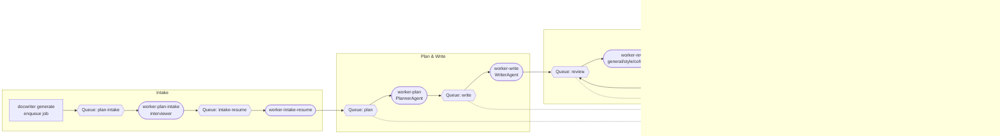

DocWriter v3 — AI Document Writer

Overview
- Generates long, consistent Markdown documents (>60 pages) with Mermaid diagrams.
- Agentic pipeline: Planner (o3), Writer (gpt-4.1), Reviewer set (o3: general + style + cohesion + executive summary).
- Queue-driven architecture on Azure Service Bus; artifacts stored in Azure Blob Storage.
- REST-first workflow: jobs are created and monitored via FastAPI; Azure Functions host each worker stage.
- Interactive intake: collects detailed requirements before planning for higher quality output.

Quick Start
1) Install dependencies (local development)
   - Python 3.10+
   - Create a virtualenv, then:
     ```bash
     pip install -e .[dev]
     npm install --prefix ui
     ```
   - PDF export uses WeasyPrint; install its system dependencies (Cairo, Pango). See https://weasyprint.readthedocs.io/en/stable/install/.
2) Configure environment variables
   - Export credentials and queue names before running workers, the API, or Functions. Example:
     ```bash
     export OPENAI_API_KEY=...
     export OPENAI_BASE_URL=...
     export OPENAI_API_VERSION=...
     export SERVICE_BUS_CONNECTION_STRING=...
     export SERVICE_BUS_QUEUE_PLAN_INTAKE=docwriter-plan-intake
     export SERVICE_BUS_QUEUE_INTAKE_RESUME=docwriter-intake-resume
     export SERVICE_BUS_QUEUE_PLAN=docwriter-plan
     export SERVICE_BUS_QUEUE_WRITE=docwriter-write
     export SERVICE_BUS_QUEUE_REVIEW=docwriter-review
     export SERVICE_BUS_QUEUE_VERIFY=docwriter-verify
     export SERVICE_BUS_QUEUE_REWRITE=docwriter-rewrite
     export SERVICE_BUS_QUEUE_FINALIZE=docwriter-finalize
     export SERVICE_BUS_TOPIC_STATUS=docwriter-status
     export SERVICE_BUS_STATUS_SUBSCRIPTION=status-writer
     export AZURE_STORAGE_CONNECTION_STRING=...
     export AZURE_BLOB_CONTAINER=docwriter
     export APPINSIGHTS_INSTRUMENTATION_KEY=... # optional, enables Application Insights telemetry
     ```
   - Optional overrides: `DOCWRITER_PLANNER_MODEL`, `DOCWRITER_WRITER_MODEL`, `DOCWRITER_STREAM`, etc. See `src/docwriter/config.py` for the full list.
3) Run locally (API + Functions)
   - Start the API: `uvicorn api.main:app --reload`
   - Start Functions host (needs Azure Functions Core Tools):
     ```bash
     cd src/functions_plan_intake && func start
     # repeat per function or package with Container Apps
     ```
   - Run the Next.js UI: `npm run dev --prefix ui` (requires `NEXT_PUBLIC_API_BASE_URL`)
   - For lightweight development, you can invoke workers directly via `python -m docwriter.queue` helper functions or tests.

GitHub Workflows
- `.github/workflows/docker-build.yml` builds all Function + API images and automatically invokes the Terraform workflow, passing the resolved Docker tag.
- `.github/workflows/terraform.yml` provisions Azure resources (Service Bus, Blob Storage, Container Apps, monitoring). Triggered manually or via `workflow_call` from the build pipeline.

FastAPI / REST usage
- Start locally: `uvicorn api.main:app --reload`
- `POST /jobs` → Enqueue a document (`{"title": "...", "audience": "...", "cycles": 2}`)
- `POST /jobs/{job_id}/resume` → Upload intake answers (`{"answers": {...}}`) and advance the pipeline
- `GET /jobs/{job_id}/status` → Latest stage snapshot
- `GET /jobs/{job_id}/timeline` → Full chronological list of status events (including review cycles and durations)
- `GET /jobs/artifacts?path=jobs/<job_id>/final.md` → Download an artifact via the API (proxy for Blob Storage)
- `POST /intake/questions` → Generate a tailored intake questionnaire
- `GET /healthz` → Basic health-check
- (Authentication and additional endpoints will be added alongside the UI.)

UI Highlights
- The `ui/` Next.js app shows job status, timeline, token usage, durations, and model names with glassmorphism styling.
- Timeline view displays every stage; review cycles can expand to show each pass (review, verify, rewrite) with metrics.
- Artifact actions use the `/jobs/artifacts` API so no direct Blob permissions are needed.

Architecture (Queue-driven)
- Agents
  - Planner (o3): Produces a structured document plan, outline, glossary, constraints, and diagram specs.
  - Writer (gpt-4.1): Writes section-by-section with a shared memory (style + facts) to maintain consistency.
  - Reviewers (o3):
    - General reviewer: contradictions and quality with revised draft.
    - Style reviewer: clarity, tone, readability.
    - Cohesion reviewer: flow, transitions, cross-references.
    - Executive summary reviewer: summary quality.
  - Interviewer (o3): Conducts an intake to gather goals, audience specifics, constraints, and preferences.
- Stage workers
  - PLAN_INTAKE (questions to Blob) → INTAKE_RESUME (user answers) → PLAN → WRITE → REVIEW (incl. style/cohesion/exec) → VERIFY → REWRITE → back to REVIEW (loop by cycles) → VERIFY → FINALIZE
  - Enforces dependency-aware order and performs contradiction verification and targeted rewrites.
- Clients
  - OpenAI client abstraction supports streaming and model selection per agent.
  - Service Bus producer/worker and Status topic for horizontal scaling and monitoring.



Azure Hosting Plan (in progress)
- **Azure Functions per stage:** Each queue processor (plan-intake, intake-resume, plan, write, review, verify, rewrite, finalize) will run as an independent Python Azure Function with a Service Bus trigger, reusing the existing `process_*` handlers.
- **Container Apps deployment:** Functions and the new REST API will be packaged as container images and hosted on Azure Container Apps for horizontal scaling and simplified ops.
- **Public API:** A lightweight FastAPI service will mirror core CLI commands (enqueue job, resume intake, status polling) so future web clients can integrate without shell access. CLI remains fully supported.
- **Terraform IaC:** Infrastructure modules (`infra/terraform`) will provision Service Bus resources, Blob Storage, Container Apps, monitoring, and identity wiring. Sample Dockerfiles and deployment scripts will live in `infra/docker` and `scripts/`.
- `infra/terraform` now contains initial modules for the resource group, Service Bus namespace, storage account, monitoring, and Container Apps environment. Provide container image references via `terraform.tfvars` before running `terraform init && terraform apply`.
- `.github/workflows/docker-build.yml` builds/pushes all container images to an Azure Container Registry using OpenID Connect. Configure repository secrets `AZURE_CLIENT_ID`, `AZURE_TENANT_ID`, `AZURE_SUBSCRIPTION_ID`, `ACR_NAME`, and `ACR_LOGIN_SERVER` before enabling the workflow.
- **Shared configuration:** All runtimes (CLI, Functions, API) read configuration exclusively from environment variables.

FastAPI / REST usage (early preview)
- Detailed in the Quick Start section. Timeline and artifact endpoints give full stage visibility without Blob access.

_Target directory highlights_
```
src/
  docwriter/              # shared core logic (existing)
  functions_*             # Azure Function apps per stage (plan_intake, plan, write, ...)
  functions_shared/       # shared Azure Function utilities
  api/                    # REST interface built on the same orchestrators
infra/
  terraform/              # Service Bus, Storage, Container Apps, monitoring
  docker/                 # container definitions for functions/API
config/
  functions.settings.json # local Functions config example
```
Documentation and deployment scripts will be updated as those components land.

Mermaid Diagrams
- The writer embeds diagrams using fenced code blocks:
  ```
  ```mermaid
  graph TD
  A[User] --> B[CLI]
  B --> C[Planner]
  C --> D[Writer]
  D --> E[Reviewer]
  ```
  ```
- Many editors render Mermaid directly. For static exports, use tools like `mermaid-cli`.

Consistency Strategy
- Global memory: style guide, glossary, decisions, and facts shared across sections.
- Section writing constrained by the plan; reviewer iteratively flags contradictions.
- Chunked generation to support very long outputs without context loss.
 - Dependency graph: sections generated in topological order; summaries of prerequisites guide dependents.
- Verifier: second pass checks final doc against dependency summaries to catch contradictions.

Status & Monitoring
- Topic: SERVICE_BUS_TOPIC_STATUS (default docwriter-status)
- Worker publishes a message for every stage transition (including START/QUEUED events). Messages include duration, token usage, model name, and artifact path.
- API exposes `/jobs/{job_id}/timeline` and `/jobs/artifacts?...` so external clients can render dashboards without direct Service Bus or Blob access.

Telemetry & Metrics
- Stage timings recorded and uploaded to Blob under jobs/<job_id>/metrics/...
- Optional OpenTelemetry export if OTEL_EXPORTER_OTLP_ENDPOINT is set.

Scalability
- Distributed only: enqueue jobs and run multiple workers per stage.
- Azure Service Bus decouples producers and workers for horizontal scale; Status topic enables dashboards.

-Configuration
- Configuration is driven by environment variables (see Quick Start). No CLI commands remain; everything runs through FastAPI and Functions.
- Models: Planner/Reviewers default to `o3`, Writer defaults to `gpt-4.1`. Token usage is reported using real API metrics when available.
- Frontend UI lives under `ui/` (Next.js + Tailwind). Set `NEXT_PUBLIC_API_BASE_URL` to your API endpoint and run `npm run dev --prefix ui` for the glass-styled intake experience.

Testing
- Run: pytest -q
- Tests use a FakeLLM for deterministic results.

Notes
- This repo scaffolds the full flow. Real LLM calls require valid API keys and Azure Service Bus + Blob access.

## Current Deployment & Operations Checklist (Snapshot)

Use these steps to reconstruct the environment in a fresh session:

1. **Container Images**
   - Build or rely on the GitHub Actions workflow (`docker-build.yml`). Images push to `aidocwriteracr.azurecr.io` with tags `:latest` and `:v<git describe>`.
   - Local build example from repo root:
     ```bash
     docker build --platform linux/amd64 -t aidocwriteracr.azurecr.io/docwriter-plan-intake:v1 -f src/functions_plan_intake/Dockerfile .
     docker push aidocwriteracr.azurecr.io/docwriter-plan-intake:v1
     # repeat for other functions + API (Dockerfile.api)
     ```

2. **Environment Variables (all runtimes)**
   ```bash
   export OPENAI_API_KEY=...
   export OPENAI_BASE_URL=...
   export OPENAI_API_VERSION=...
   export SERVICE_BUS_CONNECTION_STRING=...
   export SERVICE_BUS_QUEUE_PLAN_INTAKE=docwriter-plan-intake
   export SERVICE_BUS_QUEUE_INTAKE_RESUME=docwriter-intake-resume
   export SERVICE_BUS_QUEUE_PLAN=docwriter-plan
   export SERVICE_BUS_QUEUE_WRITE=docwriter-write
   export SERVICE_BUS_QUEUE_REVIEW=docwriter-review
   export SERVICE_BUS_QUEUE_VERIFY=docwriter-verify
   export SERVICE_BUS_QUEUE_REWRITE=docwriter-rewrite
   export SERVICE_BUS_QUEUE_FINALIZE=docwriter-finalize
   export SERVICE_BUS_TOPIC_STATUS=docwriter-status
   export SERVICE_BUS_STATUS_SUBSCRIPTION=console
   export AZURE_STORAGE_CONNECTION_STRING=...
   export AZURE_BLOB_CONTAINER=docwriter
   export APPINSIGHTS_INSTRUMENTATION_KEY=...
   export NEXT_PUBLIC_API_BASE_URL=https://<api-fqdn>
   ```

3. **Terraform deployment**
   - Secrets: `spn-client-id`, `spn-client-secret`, `spn-tenant-id`, `subscription-id`, `openai_base_url`, `openai_api_version`, `openai_api_key_secret`.
   - Modules provision RG, ACR, Service Bus, Storage, App Insights, Container Apps.
   - Container Apps module consumes `api_image`, `functions_images` (map of tags), `api_env`, `functions_env`, and optional `api_secrets` describing Key Vault secret IDs. Managed identity is granted `Key Vault Secrets User` at vault scope.
   - Run:
     ```bash
     terraform -chdir=infra/terraform init
     terraform -chdir=infra/terraform apply \
       -var "spn-client-id=..." \
       -var "spn-client-secret=..." \
       -var "spn-tenant-id=..." \
       -var "subscription-id=..." \
       -var "openai_base_url=..." \
       -var "openai_api_version=..." \
       -var "openai_api_key_secret=..."
     ```

4. **Azure Application Insights**
   - `APPINSIGHTS_INSTRUMENTATION_KEY` enables automatic event and exception tracking (`job_enqueued`, `job_status`, stage start/completion, and any errors via `track_exception`).
   - Review telemetry for lost messages or failures.

5. **Queue-driven Pipeline**
   - Messages enqueue with blob-backed draft paths; all workers read/write documents in Blob Storage.
   - Intake worker persists questions, context, and sample answers in `jobs/<id>/intake/...`. Resume pulls context blob to rebuild payload.
   - Writers, reviewers, verifier, and rewriters operate entirely from blob payloads.

6. **REST + UI**
   - API endpoints: `/jobs`, `/jobs/{id}/resume`, `/jobs/{id}/status`, `/intake/questions`, `/healthz`.
   - Next.js UI under `ui/` uses Tailwind glass theme; set `NEXT_PUBLIC_API_BASE_URL` before `npm run dev` or in deployment.
   - Intake form pre-fills sample answers returned from the API.

7. **CLI**
   - `docwriter generate` / `docwriter resume` share the same queue helpers and require the env vars above.

8. **Logging & Monitoring**
   - Workers respect `LOG_DIR`/`DOCWRITER_LOG_LEVEL` for console/file logging.
   - Application Insights now records all stage transitions and exceptions.

9. **Local sample script**
   - `scripts/run_sample_service_bus.sh` validates required env vars, enqueues a job, uploads sample answers, and signals resume.
